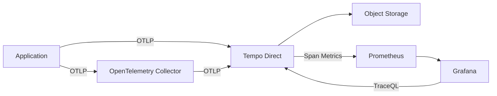

# Setting up Trace Environments with Grafana Tempo

*A Comprehensive Guide to Advanced Distributed Tracing with OpenTelemetry, Grafana, and Tempo*

---

## Table of Contents

1. [Introduction](#introduction)
2. [Understanding the Architecture](#understanding-the-architecture)
3. [Prerequisites and Dependencies](#prerequisites-and-dependencies)
4. [Setting up the Tempo Environment](#setting-up-the-tempo-environment)
5. [Configuration Deep Dive](#configuration-deep-dive)
6. [Sending Traces to Tempo](#sending-traces-to-tempo)
7. [Grafana Integration and TraceQL](#grafana-integration-and-traceql)
8. [Diagnostic Tools and Health Checks](#diagnostic-tools-and-health-checks)
9. [Advanced Configurations](#advanced-configurations)
10. [Troubleshooting Common Issues](#troubleshooting-common-issues)
11. [Production Best Practices](#production-best-practices)
12. [Appendix: Reference Materials](#appendix-reference-materials)

---

## Introduction

Modern distributed systems require sophisticated observability solutions that can handle massive scale while providing rich visualization and analysis capabilities. This book provides a comprehensive guide to setting up trace environments using Grafana Tempo, based on real-world implementations and the actual tools provided in the `/home/julianguarin/Intelepeer/otel-tools/` repository.

### Repository-Based Approach

This guide is built around the actual tools and configurations in your otel-tools repository, providing:

- **Enterprise-grade setup**: Grafana Tempo for high-scale distributed tracing
- **Rich visualization**: Grafana dashboards with advanced trace correlation
- **Ready-to-use scripts**: Pre-built diagnostic and management tools
- **Tested configurations**: Docker Compose and OpenTelemetry Collector configs that work
- **Real examples**: Actual billing session samples for realistic testing
- **TraceQL support**: Advanced query language for sophisticated trace analysis

### Key Repository Tools You'll Use

- **`start-tempo.sh`**: One-command Tempo + Grafana stack startup
- **`otel-tempo-diagnostics.sh`**: Complete Tempo/Grafana management toolkit
- **`health-check.sh`**: Quick health verification for all stacks
- **`stop-all.sh`**: Clean shutdown of all containers
- **Pre-built dashboards**: Ready-to-use Grafana dashboards for billing session tracing

### What You'll Learn

- How to use the repository tools to set up a complete Tempo + Grafana tracing environment
- OpenTelemetry Collector configuration optimized for Tempo
- How to leverage Grafana's rich visualization capabilities for trace analysis
- TraceQL query language for advanced trace searching and analysis
- How to use the built-in diagnostic tools for monitoring and troubleshooting
- Advanced configuration options for production environments
- Best practices for scaling Tempo in high-volume environments

### Why Tempo + Grafana with These Tools?

Grafana Tempo is a high-scale distributed tracing backend designed for modern cloud-native environments, and this repository provides:

- **Instant Setup**: One-command deployment with `./start-tempo.sh`
- **Enterprise Features**: TraceQL, service maps, and rich dashboards
- **Built-in Diagnostics**: Comprehensive health checks and trace analysis
- **Real Examples**: Working billing session samples for testing
- **Production Ready**: Configurations tested in real environments
- **Cost Effective**: Object storage backend for efficient trace storage

---

## Understanding the Architecture

### Core Components

Our Tempo + Grafana setup consists of four main components working together:

#### 1. Grafana Tempo
- **Purpose**: High-scale distributed tracing backend
- **Storage**: Object storage (local for development, S3/GCS for production)
- **Query Language**: TraceQL for advanced trace analysis
- **Ports**: 
  - 3200: HTTP API
  - 4317: OTLP gRPC receiver (direct)
  - 4318: OTLP HTTP receiver (direct)

#### 2. Grafana
- **Purpose**: Rich visualization and dashboard platform
- **Features**: TraceQL editor, service maps, correlations
- **Dashboards**: Pre-built billing session monitoring
- **Ports**: 3000: Web UI

#### 3. Prometheus
- **Purpose**: Metrics collection and monitoring
- **Integration**: Span metrics generation from traces
- **Alerting**: Built-in alerting capabilities
- **Ports**: 9090: Web UI

#### 4. OpenTelemetry Collector (Optional)
- **Purpose**: Advanced trace processing and routing
- **Features**: Batching, resource attribution, multi-backend support
- **Ports**: 
  - 4319: OTLP HTTP receiver (via collector)
  - 4320: OTLP gRPC receiver (via collector)

### Data Flow



### Network Architecture

All components run in an isolated Docker network (`tempo-network`) for security and communication efficiency:

```yaml
networks:
  tempo-network:
    driver: bridge
```

---

## Prerequisites and Dependencies

### System Requirements

- **Operating System**: Linux, macOS, or Windows with WSL2
- **Docker**: Version 20.0 or higher
- **Docker Compose**: Version 2.0 or higher
- **Memory**: Minimum 4GB RAM available for containers (Grafana + Tempo + Prometheus)
- **Disk Space**: At least 2GB for images and data

### Required Tools

Install these tools before proceeding:

```bash
# Ubuntu/Debian
sudo apt-get update
sudo apt-get install docker.io curl jq netcat-openbsd

# macOS (with Homebrew)
brew install docker curl jq netcat

# Verify installations
docker --version
curl --version
jq --version
nc -h
```

### Verification Script

Use the built-in dependency checker:

```bash
cd /home/julianguarin/Intelepeer/otel-tools/
./health-check.sh
```

---

## Setting up the Tempo Environment

### Repository Tools Overview

This repository provides a complete toolkit for managing Tempo + Grafana distributed tracing. The key tools include:

- **`start-tempo.sh`**: Root-level script for quick Tempo + Grafana stack startup
- **`otel-tempo-diagnostics.sh`**: Comprehensive Tempo/Grafana management and diagnostics
- **`health-check.sh`**: Quick health verification for all stacks
- **`stop-all.sh`**: Clean shutdown of all OpenTelemetry containers

### Quick Start with Repository Tools

The fastest way to get Tempo + Grafana running using the provided tools:

```bash
# Navigate to the repository root
cd /home/julianguarin/Intelepeer/otel-tools/

# Option 1: Use the quick start script
./start-tempo.sh

# Option 2: Use the comprehensive diagnostic tool
cd TempoGrafana/
./otel-tempo-diagnostics.sh start_tempo

# Verify everything is working
./otel-tempo-diagnostics.sh tempo_health

# Send a test trace
./otel-tempo-diagnostics.sh send_test_tempo
```

### Step-by-Step Setup

#### 1. Prepare the Environment

```bash
# Navigate to the otel-tools repository
cd /home/julianguarin/Intelepeer/otel-tools/

# Verify the repository structure and tools
ls -la
# Should show the main management scripts:
# - start-tempo.sh
# - stop-all.sh
# - health-check.sh

# Navigate to Tempo-specific directory
cd TempoGrafana/

# Verify Tempo-specific files exist
ls -la
# Should show:
# - docker-compose-tempo-grafana.yml
# - tempo-config.yaml
# - otel-tempo-diagnostics.sh
# - grafana-provisioning/
# - prometheus.yml
# - README-TEMPO-GRAFANA.md
```

#### 2. Start the Services Using Repository Tools

```bash
# Method 1: Use the root-level quick start script
cd /home/julianguarin/Intelepeer/otel-tools/
./start-tempo.sh

# Method 2: Use the Tempo-specific diagnostic tool
cd TempoGrafana/
./otel-tempo-diagnostics.sh start_tempo

# Method 3: Manual docker-compose (if needed)
docker compose -f docker-compose-tempo-grafana.yml up -d
```

#### 3. Verify the Setup Using Repository Tools

```bash
# Use the comprehensive health check
cd /home/julianguarin/Intelepeer/otel-tools/
./health-check.sh

# Or use the Tempo-specific health check
cd TempoGrafana/
./otel-tempo-diagnostics.sh tempo_health

# Check individual components
./otel-tempo-diagnostics.sh tempo_containers
./otel-tempo-diagnostics.sh tempo_connectivity
```

#### 4. Access the UIs

Open your browser and navigate to:
- **Grafana**: http://localhost:3000 (admin/admin)
- **Tempo API**: http://localhost:3200
- **Prometheus**: http://localhost:9090

The repository tools will display these URLs after successful startup.

### Container Management with Repository Tools

#### Starting Services
```bash
# Root-level quick start
/home/julianguarin/Intelepeer/otel-tools/start-tempo.sh

# Tempo-specific management
cd /home/julianguarin/Intelepeer/otel-tools/TempoGrafana/
./otel-tempo-diagnostics.sh start_tempo

# Manual approach (if needed)
docker compose -f docker-compose-tempo-grafana.yml up -d
```

#### Stopping Services
```bash
# Stop all OpenTelemetry containers
/home/julianguarin/Intelepeer/otel-tools/stop-all.sh

# Stop only Tempo stack
cd /home/julianguarin/Intelepeer/otel-tools/TempoGrafana/
./otel-tempo-diagnostics.sh stop_tempo

# Manual approach
docker compose -f docker-compose-tempo-grafana.yml down
```

#### Monitoring Services
```bash
# Quick health check for all stacks
/home/julianguarin/Intelepeer/otel-tools/health-check.sh

# Detailed Tempo container status
cd /home/julianguarin/Intelepeer/otel-tools/TempoGrafana/
./otel-tempo-diagnostics.sh tempo_containers

# Check connectivity
./otel-tempo-diagnostics.sh tempo_connectivity

# View logs (manual approach)
docker logs tempo
docker logs grafana
docker logs prometheus
```

---

## Configuration Deep Dive

### Docker Compose Configuration

The `docker-compose-tempo-grafana.yml` file defines our complete stack:

```yaml
version: '3.8'

services:
  # Grafana Tempo - Distributed tracing backend
  tempo:
    image: grafana/tempo:latest
    container_name: tempo
    command: [ "-config.file=/etc/tempo.yaml" ]
    volumes:
      - ./tempo-config.yaml:/etc/tempo.yaml:ro
      - tempo-data:/tmp/tempo
    user: "0:0"  # Run as root to avoid permission issues
    environment:
      - TEMPO_CONFIG_FILE=/etc/tempo.yaml
    ports:
      - "3200:3200"     # Tempo HTTP API
      - "4317:4317"     # OTLP gRPC receiver (standard port)
      - "4318:4318"     # OTLP HTTP receiver (standard port)
      - "14251:14250"   # Alternative gRPC receiver (different port)
    networks:
      - tempo-network

  # Grafana - Visualization and dashboards
  grafana:
    image: grafana/grafana:latest
    container_name: grafana
    ports:
      - "3000:3000"     # Grafana UI
    environment:
      - GF_SECURITY_ADMIN_PASSWORD=admin
      - GF_FEATURE_TOGGLES_ENABLE=traceqlEditor
      - GF_INSTALL_PLUGINS=grafana-clock-panel,grafana-simple-json-datasource
    volumes:
      - grafana-data:/var/lib/grafana
      - ./grafana-provisioning:/etc/grafana/provisioning:ro
    networks:
      - tempo-network
    depends_on:
      - tempo
    healthcheck:
      test: ["CMD-SHELL", "curl -f http://localhost:3000/api/health || exit 1"]
      interval: 30s
      timeout: 10s
      retries: 3

  # Prometheus for metrics (optional, complements tracing)
  prometheus:
    image: prom/prometheus:latest
    container_name: prometheus
    ports:
      - "9090:9090"     # Prometheus UI
    volumes:
      - ./prometheus.yml:/etc/prometheus/prometheus.yml:ro
      - prometheus-data:/prometheus
    networks:
      - tempo-network
    command:
      - '--config.file=/etc/prometheus/prometheus.yml'
      - '--storage.tsdb.path=/prometheus'
      - '--web.console.libraries=/etc/prometheus/console_libraries'
      - '--web.console.templates=/etc/prometheus/consoles'
      - '--web.enable-lifecycle'
```

### Tempo Configuration

The `tempo-config.yaml` provides the core Tempo backend configuration:

```yaml
# Minimal Tempo Configuration for Docker
server:
  http_listen_port: 3200

distributor:
  receivers:
    otlp:
      protocols:
        grpc:
          endpoint: 0.0.0.0:4317
        http:
          endpoint: 0.0.0.0:4318

ingester:
  max_block_duration: 5m

compactor:
  compaction:
    block_retention: 1h

storage:
  trace:
    backend: local
    local:
      path: /tmp/tempo/blocks
    wal:
      path: /tmp/tempo/wal

query_frontend:
  search:
    duration_slo: 5s
    throughput_bytes_slo: 1.073741824e+09
  trace_by_id:
    duration_slo: 5s
```

### Grafana Datasource Configuration

The repository includes auto-provisioned Grafana datasources in `grafana-provisioning/datasources/tempo.yml`:

```yaml
apiVersion: 1

datasources:
  # Tempo datasource for distributed tracing
  - name: Tempo
    type: tempo
    access: proxy
    url: http://tempo:3200
    uid: tempo-uid
    isDefault: true
    editable: true
    jsonData:
      tracesToMetrics:
        datasourceUid: 'prometheus-uid'
        tags: [{ key: 'service.name', value: 'service' }, { key: 'job' }]
        queries:
          - name: 'Sample query'
            query: 'sum(rate(tempo_spanmetrics_latency_bucket{$__tags}[5m]))'
      serviceMap:
        datasourceUid: 'prometheus-uid'
      nodeGraph:
        enabled: true
      search:
        hide: false

  # Prometheus datasource for metrics
  - name: Prometheus
    type: prometheus
    access: proxy
    url: http://prometheus:9090
    uid: prometheus-uid
    isDefault: false
    editable: true
```

### OpenTelemetry Collector Configuration (Optional)

For advanced processing, the repository includes `otel-collector-tempo-config.yaml`:

#### Receivers Configuration
```yaml
receivers:
  otlp:
    protocols:
      grpc:
        endpoint: 0.0.0.0:4317
      http:
        endpoint: 0.0.0.0:4318
        cors:
          allowed_origins:
            - "http://*"
            - "https://*"
```

#### Processors Configuration
```yaml
processors:
  batch:
    timeout: 1s
    send_batch_size: 1024
    send_batch_max_size: 2048
  
  # Add resource attributes for better trace identification
  resource:
    attributes:
      - key: service.instance.id
        value: "${HOSTNAME}"
        action: upsert
      - key: deployment.environment
        value: "development"
        action: upsert

  # Memory limiter to prevent OOM
  memory_limiter:
    limit_mib: 512
    spike_limit_mib: 128
```

#### Exporters Configuration
```yaml
exporters:
  # Export to Tempo
  otlp/tempo:
    endpoint: tempo:4317
    tls:
      insecure: true
  
  # Also export to console for debugging
  logging:
    loglevel: info
    sampling_initial: 5
    sampling_thereafter: 200

  # Export metrics about the collector itself
  prometheus:
    endpoint: "0.0.0.0:8888"
```

### Environment Variables

Key environment variables for customization:

```bash
# OTLP Endpoints (Direct to Tempo)
export OTEL_EXPORTER_OTLP_ENDPOINT="http://localhost:4318"
export OTEL_EXPORTER_OTLP_TRACES_ENDPOINT="http://localhost:4318/v1/traces"

# Service identification
export OTEL_SERVICE_NAME="my-service"
export OTEL_SERVICE_VERSION="1.0.0"
export OTEL_RESOURCE_ATTRIBUTES="deployment.environment=development"

# Sampling configuration
export OTEL_TRACES_SAMPLER="traceidratio"
export OTEL_TRACES_SAMPLER_ARG="0.1"  # 10% sampling
```

---

## Sending Traces to Tempo

### OTLP Protocol

Applications can send traces directly to Tempo using the OpenTelemetry Protocol (OTLP):

- **HTTP Endpoint**: `http://localhost:4318/v1/traces`
- **gRPC Endpoint**: `localhost:4317`

### Test Trace Generation Using Repository Tools

#### Built-in Test Trace with Repository Tools
```bash
# Navigate to TempoGrafana directory and send test trace
cd /home/julianguarin/Intelepeer/otel-tools/TempoGrafana/
./otel-tempo-diagnostics.sh send_test_tempo

# The tool will:
# 1. Generate a unique trace ID and span ID
# 2. Create a properly formatted OTLP trace
# 3. Send it directly to Tempo via HTTP
# 4. Provide the trace ID for verification in Grafana
```

#### Custom Test Trace
```bash
# Generate trace with custom data
trace_id=$(openssl rand -hex 16)
span_id=$(openssl rand -hex 8)
current_time_ns=$(($(date +%s) * 1000000000))

curl -X POST "http://localhost:4318/v1/traces" \
     -H "Content-Type: application/json" \
     -d '{
       "resourceSpans": [{
         "resource": {
           "attributes": [{
             "key": "service.name",
             "value": {"stringValue": "tempo-test-service"}
           }]
         },
         "scopeSpans": [{
           "spans": [{
             "traceId": "'$trace_id'",
             "spanId": "'$span_id'",
             "name": "tempo-test-operation",
             "startTimeUnixNano": "'$current_time_ns'",
             "endTimeUnixNano": "'$((current_time_ns + 100000000))'"
           }]
         }]
       }]
     }'
```

### Application Integration

#### Python Example
```python
from opentelemetry import trace
from opentelemetry.exporter.otlp.proto.http.trace_exporter import OTLPSpanExporter
from opentelemetry.sdk.trace import TracerProvider
from opentelemetry.sdk.trace.export import BatchSpanProcessor

# Configure the tracer
trace.set_tracer_provider(TracerProvider())
tracer = trace.get_tracer(__name__)

# Configure OTLP exporter for Tempo
otlp_exporter = OTLPSpanExporter(
    endpoint="http://localhost:4318/v1/traces",
)

# Add span processor
span_processor = BatchSpanProcessor(otlp_exporter)
trace.get_tracer_provider().add_span_processor(span_processor)

# Create a trace
with tracer.start_as_current_span("my-operation") as span:
    span.set_attribute("user.id", "user123")
    span.set_attribute("operation.type", "payment")
    # Your application logic here
    pass
```

#### Java Example
```java
import io.opentelemetry.api.OpenTelemetry;
import io.opentelemetry.api.trace.Span;
import io.opentelemetry.api.trace.Tracer;
import io.opentelemetry.exporter.otlp.http.trace.OtlpHttpSpanExporter;
import io.opentelemetry.sdk.OpenTelemetrySdk;
import io.opentelemetry.sdk.trace.SdkTracerProvider;
import io.opentelemetry.sdk.trace.export.BatchSpanProcessor;

// Configure OpenTelemetry for Tempo
OtlpHttpSpanExporter spanExporter = OtlpHttpSpanExporter.builder()
    .setEndpoint("http://localhost:4318/v1/traces")
    .build();

SdkTracerProvider tracerProvider = SdkTracerProvider.builder()
    .addSpanProcessor(BatchSpanProcessor.builder(spanExporter).build())
    .build();

OpenTelemetry openTelemetry = OpenTelemetrySdk.builder()
    .setTracerProvider(tracerProvider)
    .build();

// Create traces
Tracer tracer = openTelemetry.getTracer("my-application");
Span span = tracer.spanBuilder("my-operation").startSpan();
try {
    span.setAttribute("user.id", "user123");
    span.setAttribute("operation.type", "payment");
    // Your application logic here
} finally {
    span.end();
}
```

### Billing Session Example Using Repository Tools

The repository includes a comprehensive billing session example that demonstrates real-world tracing scenarios:

```bash
# Navigate to TempoGrafana directory
cd /home/julianguarin/Intelepeer/otel-tools/TempoGrafana/

# Run the billing session sample against Tempo
./otel-tempo-diagnostics.sh run_billing_tempo

# This tool will:
# 1. Locate the billing session sample executable
# 2. Configure it to use the Tempo OTLP endpoint (port 4318)
# 3. Execute the sample to generate realistic traces
# 4. Provide instructions for viewing traces in Grafana
```

This generates realistic traces showing:
- Session lifecycle (start, operations, end)
- Payment processing with gateway interactions
- Usage charges and billing calculations
- Error handling and retry mechanisms
- Multi-span transactions with proper parent-child relationships
- Resource attributes for customer and session identification

The sample executable is located at:
```
/home/julianguarin/Intelepeer/oss-common/telemetry/examples/billingsession/SimpleBillableSessionDemo
```

And the repository tool automatically configures the correct OTLP endpoint for Tempo.

---

## Grafana Integration and TraceQL

### Accessing Grafana

After starting the stack, access Grafana at:
- **URL**: http://localhost:3000
- **Username**: admin
- **Password**: admin

### Pre-built Dashboards

The repository includes pre-configured dashboards for billing session monitoring:

1. **Navigate to Dashboards** → **Browse**
2. **Find**: "OpenTelemetry Billing Session Tracing" dashboard
3. **Features**:
   - Service health overview
   - Payment operation performance
   - Session analysis with costs
   - Error rate monitoring

### TraceQL Query Language

TraceQL is Tempo's powerful query language for advanced trace analysis:

#### Basic Queries
```traceql
# Find all traces for a service
{service.name="billing-service"}

# Find traces with specific attributes
{resource.customer.id="customer-alice"}

# Find traces by operation name
{name="process-payment"}
```

#### Advanced Queries
```traceql
# Find slow payment operations (>100ms)
{service.name="billing-service" && name="process-payment"} | select(duration > 100ms)

# Find failed payment gateway calls
{service.name="billing-service" && name="payment-gateway-call" && status=error}

# Session analysis with costs
{resource.session.id=~"sess-.*"} | select(resource.session.total_cost, duration)

# Complex aggregations
{service.name="billing-service"} 
| select(resource.session.total_cost, duration) 
| by(resource.customer.id)
```

#### Span Filtering
```traceql
# Find traces with high latency spans
{} | select(duration > 1s)

# Find traces with specific error codes
{} | select(span.http.status_code >= 400)

# Find traces with custom attributes
{} | select(span.custom.payment_method = "credit_card")
```

### Service Maps

Grafana automatically generates service maps from your traces:

1. **Go to Explore** → **Select Tempo datasource**
2. **Query**: `{service.name="billing-service"}`
3. **Click Service Map tab**
4. **Visualize**: Service dependencies and call patterns

### Trace to Metrics Correlation

The repository configuration enables automatic correlation between traces and metrics:

- **Span Metrics**: Automatically generated from trace data
- **Performance Metrics**: Request rates, latency percentiles
- **Error Metrics**: Failed operations and timeouts

---

## Diagnostic Tools and Health Checks

### Repository Diagnostic Tools Overview

This repository provides multiple diagnostic tools for different levels of analysis:

1. **`health-check.sh`** - Quick overview of all OpenTelemetry stacks
2. **`otel-tempo-diagnostics.sh`** - Tempo/Grafana-specific management and diagnostics

### Primary Diagnostic Tool: `otel-tempo-diagnostics.sh`

Located in `/home/julianguarin/Intelepeer/otel-tools/TempoGrafana/`, this is your main tool for Tempo operations:

#### Health Check Commands
```bash
cd /home/julianguarin/Intelepeer/otel-tools/TempoGrafana/

# Complete stack health check
./otel-tempo-diagnostics.sh tempo_health

# Check container status
./otel-tempo-diagnostics.sh tempo_containers

# Test connectivity
./otel-tempo-diagnostics.sh tempo_connectivity
```

#### Stack Management Commands
```bash
cd /home/julianguarin/Intelepeer/otel-tools/TempoGrafana/

# Start the stack
./otel-tempo-diagnostics.sh start_tempo

# Stop the stack
./otel-tempo-diagnostics.sh stop_tempo
```

#### Testing Commands
```bash
cd /home/julianguarin/Intelepeer/otel-tools/TempoGrafana/

# Send test trace
./otel-tempo-diagnostics.sh send_test_tempo

# Run billing sample
./otel-tempo-diagnostics.sh run_billing_tempo

# Query recent traces
./otel-tempo-diagnostics.sh query_tempo billing-service 10

# Get specific trace details
./otel-tempo-diagnostics.sh get_tempo_trace <trace_id>
```

### Quick Health Check Tool: `health-check.sh`

For a fast overview of all your OpenTelemetry stacks:

```bash
cd /home/julianguarin/Intelepeer/otel-tools/
./health-check.sh

# This tool will:
# 1. Show currently running containers
# 2. Check Tempo/Grafana stack health (if running)
# 3. Provide quick start commands
```

### Manual Health Checks

#### Container Status
```bash
# Check running containers
docker ps --format "table {{.Names}}\t{{.Status}}\t{{.Ports}}" | grep -E "(tempo|grafana|prometheus)"

# Check container logs
docker logs tempo --tail 50
docker logs grafana --tail 50
docker logs prometheus --tail 50
```

#### Endpoint Testing
```bash
# Test Tempo API
curl -s http://localhost:3200/ready && echo "Tempo ready" || echo "Tempo not ready"

# Test Grafana UI
curl -s http://localhost:3000/api/health | jq '.database' && echo "Grafana healthy" || echo "Grafana not healthy"

# Test Prometheus
curl -s http://localhost:9090/-/healthy && echo "Prometheus healthy" || echo "Prometheus not healthy"

# Test OTLP endpoints
curl -s -o /dev/null -w "%{http_code}" http://localhost:4318 | grep -q "404\|405" && echo "OTLP HTTP accessible" || echo "OTLP HTTP not accessible"
nc -z localhost 4317 && echo "OTLP gRPC accessible" || echo "OTLP gRPC not accessible"
```

#### Trace Query Testing
```bash
# Query traces via Tempo API
curl -s "http://localhost:3200/api/search?tags=service.name=billing-service" | jq '.traces[0]'

# Check trace ingestion
curl -s "http://localhost:3200/api/echo" && echo "Tempo API responding"
```

---

## Advanced Configurations

### Production Optimizations

#### Resource Limits
```yaml
# docker-compose-tempo-grafana.yml
services:
  tempo:
    deploy:
      resources:
        limits:
          memory: 2G
          cpus: '1.0'
        reservations:
          memory: 1G
          cpus: '0.5'
  
  grafana:
    deploy:
      resources:
        limits:
          memory: 1G
          cpus: '0.5'
```

#### Object Storage Backend
```yaml
# tempo-config.yaml - Production storage
storage:
  trace:
    backend: s3
    s3:
      bucket: tempo-traces-production
      endpoint: s3.amazonaws.com
      access_key: ${AWS_ACCESS_KEY_ID}
      secret_key: ${AWS_SECRET_ACCESS_KEY}
      region: us-west-2
    wal:
      path: /tmp/tempo/wal
```

#### Retention Configuration
```yaml
# tempo-config.yaml - Configure retention
compactor:
  compaction:
    block_retention: 24h      # Keep traces for 24 hours
    compacted_block_retention: 1h
    retention_concurrency: 10
    max_compaction_objects: 1000000
```

### Security Configuration

#### TLS/SSL Setup
```yaml
# tempo-config.yaml
server:
  http_listen_port: 3200
  grpc_listen_port: 9095
  http_tls_config:
    cert_file: /etc/ssl/certs/tempo.crt
    key_file: /etc/ssl/private/tempo.key
  grpc_tls_config:
    cert_file: /etc/ssl/certs/tempo.crt
    key_file: /etc/ssl/private/tempo.key
```

#### Grafana Authentication
```yaml
# docker-compose-tempo-grafana.yml
services:
  grafana:
    environment:
      - GF_AUTH_ANONYMOUS_ENABLED=false
      - GF_AUTH_BASIC_ENABLED=true
      - GF_SECURITY_ADMIN_PASSWORD=${GRAFANA_ADMIN_PASSWORD}
      - GF_USERS_ALLOW_SIGN_UP=false
```

### Scaling Configuration

#### Multi-instance Tempo
```yaml
# docker-compose-tempo-grafana.yml - Scaled deployment
services:
  tempo-distributor:
    image: grafana/tempo:latest
    command: ["-target=distributor", "-config.file=/etc/tempo.yaml"]
    replicas: 3
    
  tempo-ingester:
    image: grafana/tempo:latest
    command: ["-target=ingester", "-config.file=/etc/tempo.yaml"]
    replicas: 2
    
  tempo-querier:
    image: grafana/tempo:latest
    command: ["-target=querier", "-config.file=/etc/tempo.yaml"]
    replicas: 2
```

#### Performance Tuning
```yaml
# tempo-config.yaml - Performance optimization
ingester:
  max_block_duration: 2m        # Reduce for faster queries
  max_block_bytes: 500_000      # Reduce memory usage
  complete_block_timeout: 30s

distributor:
  receivers:
    otlp:
      protocols:
        grpc:
          max_recv_msg_size_mib: 64
          max_concurrent_streams: 32
        http:
          max_request_body_size_mib: 64

query_frontend:
  max_outstanding_per_tenant: 2000
  search:
    concurrent_jobs: 2000
    target_bytes_per_job: 104857600  # 100MB
```

---

## Troubleshooting Common Issues

### Container Startup Issues

#### Problem: Containers fail to start
```bash
# Check container logs
docker logs tempo
docker logs grafana
docker logs prometheus

# Common issues:
# - Port conflicts
# - Missing configuration files
# - Insufficient resources
```

**Solution:**
```bash
# Check for port conflicts
netstat -tulpn | grep -E "(3000|3200|4317|4318|9090)"

# Stop conflicting services
sudo systemctl stop <conflicting-service>

# Verify configuration files exist
ls -la tempo-config.yaml docker-compose-tempo-grafana.yml
```

#### Problem: Permission denied errors
```bash
# Error: Permission denied accessing config files or volumes
```

**Solution:**
```bash
# Fix file permissions
chmod 644 tempo-config.yaml
chmod 644 docker-compose-tempo-grafana.yml

# Fix volume permissions
sudo chown -R 472:472 grafana-data/  # Grafana user ID
sudo chown -R 10001:10001 tempo-data/  # Tempo user ID
```

### Connectivity Issues

#### Problem: Cannot connect to Tempo API
```bash
# Test connectivity
curl http://localhost:3200/ready
# Connection refused
```

**Solution:**
```bash
# Check if Tempo is running
docker ps | grep tempo

# Check container logs
docker logs tempo

# Verify port bindings
docker port tempo
```

#### Problem: Grafana cannot connect to Tempo
```bash
# Error: Cannot connect to Tempo datasource
```

**Solution:**
```bash
# Check Tempo API from Grafana container
docker exec grafana curl http://tempo:3200/ready

# Verify network connectivity
docker network inspect tempo-network

# Check datasource configuration in Grafana UI
# Go to Configuration → Data Sources → Tempo
# URL should be: http://tempo:3200
```

### Trace Data Issues

#### Problem: No traces appearing in Grafana
```bash
# Traces sent but not visible
```

**Solution:**
```bash
# Send test trace
cd /home/julianguarin/Intelepeer/otel-tools/TempoGrafana/
./otel-tempo-diagnostics.sh send_test_tempo

# Check Tempo logs for errors
docker logs tempo | grep -i error

# Verify trace ingestion
curl -s "http://localhost:3200/api/search?tags=service.name=tempo-test-service"

# Check Grafana datasource
# Go to Grafana → Configuration → Data Sources → Tempo → Test
```

#### Problem: High memory usage
```bash
# Tempo consuming too much memory
```

**Solution:**
```yaml
# Reduce memory usage in tempo-config.yaml
ingester:
  max_block_bytes: 250_000      # Reduce from 500_000
  max_block_duration: 1m        # Reduce from 2m

distributor:
  receivers:
    otlp:
      protocols:
        grpc:
          max_recv_msg_size_mib: 32  # Reduce from 64
```

### TraceQL Query Issues

#### Problem: TraceQL queries return no results
```bash
# Queries work in API but not in Grafana
```

**Solution:**
```bash
# Test query directly against Tempo API
curl -G "http://localhost:3200/api/search" \
  --data-urlencode 'q={service.name="billing-service"}'

# Check time range in Grafana
# Ensure time range covers when traces were sent

# Verify service names
curl -s "http://localhost:3200/api/search/tag/service.name/values"
```

#### Problem: Slow TraceQL queries
```bash
# Queries timeout or take too long
```

**Solution:**
```yaml
# Optimize query performance in tempo-config.yaml
query_frontend:
  search:
    concurrent_jobs: 1000        # Reduce from 2000
    target_bytes_per_job: 52428800  # 50MB, reduce from 100MB
  trace_by_id:
    query_timeout: 30s
```

### Network Issues

#### Problem: DNS resolution failures
```bash
# Error: cannot resolve tempo hostname
```

**Solution:**
```bash
# Check network connectivity
docker network ls | grep tempo

# Recreate network
docker network rm tempo-network
docker compose up -d
```

#### Problem: Cross-container communication fails
```bash
# Grafana cannot reach Tempo or Prometheus
```

**Solution:**
```yaml
# Verify network configuration in docker-compose-tempo-grafana.yml
networks:
  tempo-network:
    driver: bridge

# Ensure all services use the same network
services:
  tempo:
    networks:
      - tempo-network
  grafana:
    networks:
      - tempo-network
  prometheus:
    networks:
      - tempo-network
```

---

## Production Best Practices

### Development to Production Migration

#### 1. Environment Separation
```bash
# Development environment
export OTEL_RESOURCE_ATTRIBUTES="deployment.environment=development"

# Production environment  
export OTEL_RESOURCE_ATTRIBUTES="deployment.environment=production"
```

#### 2. Storage Strategy
```yaml
# Development: Local storage
storage:
  trace:
    backend: local
    local:
      path: /tmp/tempo/blocks

# Production: Object storage
storage:
  trace:
    backend: s3
    s3:
      bucket: tempo-traces-prod
      region: us-west-2
```

#### 3. Retention Policy
```yaml
# Development: Short retention
compactor:
  compaction:
    block_retention: 1h

# Production: Longer retention
compactor:
  compaction:
    block_retention: 168h  # 7 days
    compacted_block_retention: 24h
```

### Best Practices

#### 1. Service Naming
```python
# Use consistent service naming
export OTEL_SERVICE_NAME="billing-service"
export OTEL_SERVICE_VERSION="1.2.3"
export OTEL_SERVICE_NAMESPACE="payment"
```

#### 2. Span Attributes
```python
# Add meaningful attributes for TraceQL queries
span.set_attribute("user.id", user_id)
span.set_attribute("order.id", order_id)
span.set_attribute("payment.method", "credit_card")
span.set_attribute("payment.amount", amount)
span.set_attribute("customer.tier", "premium")
```

#### 3. Error Handling
```python
try:
    # Your operation
    result = process_payment()
    span.set_status(Status(StatusCode.OK))
except Exception as e:
    span.set_status(Status(StatusCode.ERROR, str(e)))
    span.record_exception(e)
    span.set_attribute("error.type", type(e).__name__)
    raise
```

#### 4. Resource Attribution
```yaml
# Collector configuration for rich resource attributes
processors:
  resource:
    attributes:
      - key: service.instance.id
        value: "${HOSTNAME}"
        action: upsert
      - key: deployment.environment
        value: "production"
        action: upsert
      - key: k8s.cluster.name
        value: "production-cluster"
        action: upsert
      - key: cloud.provider
        value: "aws"
        action: upsert
```

### Monitoring Your Tracing Infrastructure

#### 1. Tempo Metrics
```bash
# Monitor Tempo health via Prometheus
curl http://localhost:9090/api/v1/query?query=tempo_build_info

# Key metrics to monitor:
# - tempo_ingester_blocks_total
# - tempo_distributor_spans_received_total
# - tempo_query_frontend_queries_total
```

#### 2. Grafana Metrics
```bash
# Monitor Grafana performance
curl http://localhost:3000/api/health

# Key metrics:
# - grafana_api_response_status_total
# - grafana_database_conn_*
# - grafana_alerting_*
```

#### 3. Alert Configuration
```yaml
# prometheus.yml - Alerting rules
rule_files:
  - "tempo_alerts.yml"

# tempo_alerts.yml
groups:
  - name: tempo
    rules:
      - alert: TempoDown
        expr: up{job="tempo"} == 0
        for: 5m
        labels:
          severity: critical
        annotations:
          summary: "Tempo is down"
      
      - alert: HighTraceIngestionLatency
        expr: histogram_quantile(0.95, rate(tempo_distributor_spans_received_total[5m])) > 1000
        for: 10m
        labels:
          severity: warning
        annotations:
          summary: "High trace ingestion latency"
          
      - alert: GrafanaDown
        expr: up{job="grafana"} == 0
        for: 5m
        labels:
          severity: critical
        annotations:
          summary: "Grafana is down"
```

---

## Appendix: Reference Materials

### Port Reference

| Service | Port | Protocol | Purpose |
|---------|------|----------|---------|
| Grafana | 3000 | HTTP | Web interface |
| Tempo API | 3200 | HTTP | Tempo HTTP API |
| Tempo OTLP | 4317 | gRPC | OpenTelemetry protocol |
| Tempo OTLP | 4318 | HTTP | OpenTelemetry protocol |
| Prometheus | 9090 | HTTP | Metrics and alerting |

### Environment Variables Reference

```bash
# Service identification
OTEL_SERVICE_NAME="my-service"
OTEL_SERVICE_VERSION="1.0.0"
OTEL_SERVICE_NAMESPACE="my-namespace"

# Endpoint configuration (Direct to Tempo)
OTEL_EXPORTER_OTLP_ENDPOINT="http://localhost:4318"
OTEL_EXPORTER_OTLP_TRACES_ENDPOINT="http://localhost:4318/v1/traces"

# Resource attributes
OTEL_RESOURCE_ATTRIBUTES="deployment.environment=production,service.instance.id=instance-1"

# Sampling configuration
OTEL_TRACES_SAMPLER="traceidratio"
OTEL_TRACES_SAMPLER_ARG="0.1"

# Batch configuration
OTEL_BSP_MAX_EXPORT_BATCH_SIZE="512"
OTEL_BSP_EXPORT_TIMEOUT="30000"
OTEL_BSP_SCHEDULE_DELAY="5000"
```

### Useful Repository Commands Reference

```bash
# Navigate to repository root
cd /home/julianguarin/Intelepeer/otel-tools/

# Quick health check for all stacks
./health-check.sh

# Start/Stop stacks
./start-tempo.sh              # Start Tempo/Grafana stack
./stop-all.sh                 # Stop all containers

# Tempo-specific operations
cd TempoGrafana/
./otel-tempo-diagnostics.sh tempo_health          # Health check
./otel-tempo-diagnostics.sh send_test_tempo       # Send test trace
./otel-tempo-diagnostics.sh run_billing_tempo     # Run billing sample
./otel-tempo-diagnostics.sh start_tempo           # Start stack
./otel-tempo-diagnostics.sh stop_tempo            # Stop stack
./otel-tempo-diagnostics.sh query_tempo billing-service 10  # Query traces

# Container management (manual)
docker ps | grep -E "(tempo|grafana|prometheus)"
docker logs tempo --tail 50
docker logs grafana --tail 50

# Network troubleshooting
docker network ls | grep tempo
docker network inspect tempo-network
```

### TraceQL Examples Reference

```traceql
# Basic service queries
{service.name="billing-service"}
{resource.customer.id="customer-123"}
{name="process-payment"}

# Performance analysis
{service.name="billing-service"} | select(duration > 100ms)
{} | select(span.http.status_code >= 400)

# Business logic queries
{resource.session.id=~"sess-.*"} | select(resource.session.total_cost, duration)
{service.name="billing-service" && name="payment-gateway-call" && status=error}

# Aggregations and grouping
{service.name="billing-service"} 
| select(resource.session.total_cost, duration) 
| by(resource.customer.id)

# Complex filtering
{service.name="billing-service"} 
| select(duration > 100ms && span.payment.amount > 1000)
| by(span.payment.method)
```

### Useful Links

- **Grafana Tempo Documentation**: https://grafana.com/docs/tempo/
- **TraceQL Query Language**: https://grafana.com/docs/tempo/latest/traceql/
- **Grafana Tracing Guide**: https://grafana.com/docs/grafana/latest/datasources/tempo/
- **OpenTelemetry Docs**: https://opentelemetry.io/docs/
- **OTLP Protocol Spec**: https://github.com/open-telemetry/opentelemetry-specification/blob/main/specification/protocol/otlp.md
- **Prometheus Documentation**: https://prometheus.io/docs/

---

## Conclusion

This guide has provided you with a comprehensive understanding of setting up and managing Grafana Tempo-based distributed tracing environments. From basic setup to advanced configurations, you now have the tools and knowledge to implement enterprise-grade tracing solutions with rich visualization capabilities.

### Key Takeaways

1. **Start Simple**: Use the provided scripts for quick setup and testing
2. **Leverage TraceQL**: Master the query language for powerful trace analysis
3. **Monitor Health**: Regular health checks prevent issues before they impact users
4. **Plan for Scale**: Consider production requirements early in your design
5. **Follow Best Practices**: Consistent naming, proper error handling, and meaningful attributes
6. **Use Grafana Features**: Leverage dashboards, service maps, and correlations

### Next Steps

1. Set up your first Tempo + Grafana environment using this guide
2. Instrument a sample application to generate traces
3. Explore TraceQL queries to understand your trace data
4. Create custom Grafana dashboards for your specific use cases
5. Plan your production deployment strategy with object storage
6. Scale your Tempo deployment for production workloads

Happy tracing with Grafana Tempo!

---

*This guide is based on the real-world implementations in the otel-tools repository and represents battle-tested configurations for distributed tracing with Grafana Tempo.*
