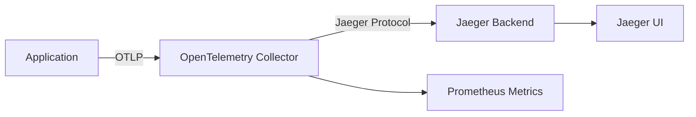

# Setting up Trace Environments with Jaeger

*A Comprehensive Guide to Distributed Tracing with OpenTelemetry and Jaeger*

---

## Table of Contents

1. [Introduction](#introduction)
2. [Understanding the Architecture](#understanding-the-architecture)
3. [Prerequisites and Dependencies](#prerequisites-and-dependencies)
4. [Setting up the Jaeger Environment](#setting-up-the-jaeger-environment)
5. [Configuration Deep Dive](#configuration-deep-dive)
6. [Sending Traces to Jaeger](#sending-traces-to-jaeger)
7. [Diagnostic Tools and Health Checks](#diagnostic-tools-and-health-checks)
8. [Advanced Configurations](#advanced-configurations)
9. [Troubleshooting Common Issues](#troubleshooting-common-issues)
10. [Production Best Practices](#production-best-practices)
11. [Appendix: Reference Materials](#appendix-reference-materials)

---

## Introduction

Distributed tracing has become essential for understanding the behavior of modern microservices architectures. This book provides a comprehensive guide to setting up trace environments using Jaeger, based on real-world implementations and the actual tools provided in the `/home/julianguarin/Intelepeer/otel-tools/` repository.

### Repository-Based Approach

This guide is built around the actual tools and configurations in your otel-tools repository, providing:

- **Ready-to-use scripts**: Pre-built diagnostic and management tools
- **Tested configurations**: Docker Compose and OpenTelemetry Collector configs that work
- **Real examples**: Actual billing session samples for realistic testing
- **Comprehensive diagnostics**: Built-in health checks and troubleshooting tools

### Key Repository Tools You'll Use

- **`start-jaeger.sh`**: One-command Jaeger stack startup
- **`otel-jaeger-diagnostics.sh`**: Complete Jaeger management toolkit
- **`otel-diagnostics.sh`**: Advanced trace analysis and monitoring
- **`health-check.sh`**: Quick health verification for all stacks
- **`stop-all.sh`**: Clean shutdown of all containers

### What You'll Learn

- How to use the repository tools to set up a complete Jaeger tracing environment
- OpenTelemetry Collector configuration used in the repository
- How to leverage the built-in diagnostic tools for monitoring and troubleshooting
- Advanced configuration options for production environments
- Best practices for scaling Jaeger in production

### Why Jaeger with These Tools?

Jaeger is a mature, battle-tested distributed tracing system, and this repository provides:

- **Instant Setup**: One-command deployment with `./start-jaeger.sh`
- **Built-in Diagnostics**: Comprehensive health checks and trace analysis
- **Real Examples**: Working billing session samples for testing
- **Production Ready**: Configurations tested in real environments
- **Scalable Architecture**: Configurations ready for production deployment

---

## Understanding the Architecture

### Core Components

Our Jaeger setup consists of two main components working together:

#### 1. Jaeger All-in-One
- **Purpose**: Complete tracing backend in a single container
- **Includes**: Collector, Query service, and Web UI
- **Storage**: In-memory (development) or persistent (production)
- **Ports**: 
  - 16686: Web UI
  - 14250: gRPC receiver
  - 14268: HTTP receiver

#### 2. OpenTelemetry Collector
- **Purpose**: Receives, processes, and forwards trace data
- **Protocols**: OTLP HTTP/gRPC, Jaeger native
- **Processing**: Batching, resource attribution, memory management
- **Ports**:
  - 4317: OTLP gRPC receiver
  - 4318: OTLP HTTP receiver
  - 8888: Prometheus metrics

### Data Flow



### Network Architecture

All components run in an isolated Docker network (`jaeger-network`) for security and communication efficiency:

```yaml
networks:
  jaeger-network:
    driver: bridge
```

---

## Prerequisites and Dependencies

### System Requirements

- **Operating System**: Linux, macOS, or Windows with WSL2
- **Docker**: Version 20.0 or higher
- **Docker Compose**: Version 2.0 or higher
- **Memory**: Minimum 2GB RAM available for containers
- **Disk Space**: At least 1GB for images and data

### Required Tools

Install these tools before proceeding:

```bash
# Ubuntu/Debian
sudo apt-get update
sudo apt-get install docker.io curl jq netcat-openbsd

# macOS (with Homebrew)
brew install docker curl jq netcat

# Verify installations
docker --version
curl --version
jq --version
nc -h
```

### Verification Script

Use the built-in dependency checker:

```bash
./otel-diagnostics.sh check_dependencies
```

---

## Setting up the Jaeger Environment

### Repository Tools Overview

This repository provides a complete toolkit for managing Jaeger-based distributed tracing. The key tools include:

- **`start-jaeger.sh`**: Root-level script for quick Jaeger stack startup
- **`otel-jaeger-diagnostics.sh`**: Comprehensive Jaeger management and diagnostics
- **`otel-diagnostics.sh`**: Legacy full-featured diagnostic tool with advanced trace analysis
- **`health-check.sh`**: Quick health verification for all stacks
- **`stop-all.sh`**: Clean shutdown of all OpenTelemetry containers

### Quick Start with Repository Tools

The fastest way to get Jaeger running using the provided tools:

```bash
# Navigate to the repository root
cd /home/julianguarin/Intelepeer/otel-tools/

# Option 1: Use the quick start script
./start-jaeger.sh

# Option 2: Use the comprehensive diagnostic tool
cd Jaeger/
./otel-jaeger-diagnostics.sh start_jaeger

# Verify everything is working
./otel-jaeger-diagnostics.sh jaeger_health

# Send a test trace
./otel-jaeger-diagnostics.sh send_test_jaeger
```

### Step-by-Step Setup

#### 1. Prepare the Environment

```bash
# Navigate to the otel-tools repository
cd /home/julianguarin/Intelepeer/otel-tools/

# Verify the repository structure and tools
ls -la
# Should show the main management scripts:
# - start-jaeger.sh
# - start-tempo.sh  
# - stop-all.sh
# - health-check.sh
# - otel-diagnostics.sh

# Navigate to Jaeger-specific directory
cd Jaeger/

# Verify Jaeger-specific files exist
ls -la
# Should show:
# - docker-compose-jaeger.yml
# - otel-collector-jaeger-config.yaml
# - otel-jaeger-diagnostics.sh
# - README.md
```

#### 2. Start the Services Using Repository Tools

```bash
# Method 1: Use the root-level quick start script
cd /home/julianguarin/Intelepeer/otel-tools/
./start-jaeger.sh

# Method 2: Use the Jaeger-specific diagnostic tool
cd Jaeger/
./otel-jaeger-diagnostics.sh start_jaeger

# Method 3: Manual docker-compose (if needed)
docker compose -f docker-compose-jaeger.yml up -d
```

#### 3. Verify the Setup Using Repository Tools

```bash
# Use the comprehensive health check
cd /home/julianguarin/Intelepeer/otel-tools/
./health-check.sh

# Or use the Jaeger-specific health check
cd Jaeger/
./otel-jaeger-diagnostics.sh jaeger_health

# Or use the legacy diagnostic tool for detailed analysis
cd /home/julianguarin/Intelepeer/otel-tools/
./otel-diagnostics.sh health_check
```

#### 4. Access the UI

Open your browser and navigate to:
- **Jaeger UI**: http://localhost:16686

The repository tools will display these URLs after successful startup.

### Container Management with Repository Tools

#### Starting Services
```bash
# Root-level quick start
/home/julianguarin/Intelepeer/otel-tools/start-jaeger.sh

# Jaeger-specific management
cd /home/julianguarin/Intelepeer/otel-tools/Jaeger/
./otel-jaeger-diagnostics.sh start_jaeger

# Manual approach (if needed)
docker compose -f docker-compose-jaeger.yml up -d
```

#### Stopping Services
```bash
# Stop all OpenTelemetry containers (Jaeger + Tempo)
/home/julianguarin/Intelepeer/otel-tools/stop-all.sh

# Stop only Jaeger stack
cd /home/julianguarin/Intelepeer/otel-tools/Jaeger/
./otel-jaeger-diagnostics.sh stop_jaeger

# Manual approach
docker compose -f docker-compose-jaeger.yml down
```

#### Monitoring Services
```bash
# Quick health check for all stacks
/home/julianguarin/Intelepeer/otel-tools/health-check.sh

# Detailed Jaeger container status
cd /home/julianguarin/Intelepeer/otel-tools/Jaeger/
./otel-jaeger-diagnostics.sh jaeger_containers

# Check connectivity
./otel-jaeger-diagnostics.sh jaeger_connectivity

# View logs (manual approach)
docker logs jaeger
docker logs otel-collector
```

---

## Configuration Deep Dive

### Docker Compose Configuration

The `docker-compose-jaeger.yml` file defines our complete stack:

```yaml
version: '3.8'

services:
  # OpenTelemetry Collector for Jaeger
  otel-collector:
    image: otel/opentelemetry-collector-contrib:latest
    container_name: otel-collector
    command: ["--config=/etc/otel-collector-config.yaml"]
    volumes:
      - ./otel-collector-jaeger-config.yaml:/etc/otel-collector-config.yaml:ro
    ports:
      - "4317:4317"     # OTLP gRPC receiver
      - "4318:4318"     # OTLP HTTP receiver
      - "8888:8888"     # Prometheus metrics
      - "8889:8889"     # Prometheus metrics (legacy)
    networks:
      - jaeger-network
    depends_on:
      - jaeger

  # Jaeger All-in-One
  jaeger:
    image: jaegertracing/all-in-one:latest
    container_name: jaeger
    ports:
      - "16686:16686"   # Jaeger UI
      - "14250:14250"   # Jaeger gRPC receiver
      - "14268:14268"   # Jaeger HTTP receiver
      - "6831:6831/udp" # Jaeger UDP receiver
      - "6832:6832/udp" # Jaeger UDP receiver
    environment:
      - COLLECTOR_OTLP_ENABLED=true
      - COLLECTOR_ZIPKIN_HOST_PORT=:9411
    networks:
      - jaeger-network
    healthcheck:
      test: ["CMD-SHELL", "wget --no-verbose --tries=1 --spider http://localhost:16686 || exit 1"]
      interval: 30s
      timeout: 10s
      retries: 3
```

### OpenTelemetry Collector Configuration

The `otel-collector-jaeger-config.yaml` provides comprehensive trace processing:

#### Receivers Configuration
```yaml
receivers:
  otlp:
    protocols:
      grpc:
        endpoint: 0.0.0.0:4317
      http:
        endpoint: 0.0.0.0:4318
        cors:
          allowed_origins:
            - "http://*"
            - "https://*"
```

#### Processors Configuration
```yaml
processors:
  batch:
    timeout: 1s
    send_batch_size: 1024
    send_batch_max_size: 2048
  
  # Add resource attributes for better trace identification
  resource:
    attributes:
      - key: service.instance.id
        value: "${HOSTNAME}"
        action: upsert
      - key: deployment.environment
        value: "development"
        action: upsert

  # Memory limiter to prevent OOM
  memory_limiter:
    limit_mib: 512
    spike_limit_mib: 128
```

#### Exporters Configuration
```yaml
exporters:
  # Export to Jaeger
  jaeger:
    endpoint: jaeger:14250
    tls:
      insecure: true
  
  # Also export to console for debugging
  logging:
    loglevel: info
    sampling_initial: 5
    sampling_thereafter: 200

  # Export metrics about the collector itself
  prometheus:
    endpoint: "0.0.0.0:8888"
```

#### Service Pipeline
```yaml
service:
  pipelines:
    traces:
      receivers: [otlp]
      processors: [memory_limiter, resource, batch]
      exporters: [jaeger, logging]
    
    metrics:
      receivers: [otlp]
      processors: [memory_limiter, batch]
      exporters: [prometheus]

  extensions: [health_check]
```

### Environment Variables

Key environment variables for customization:

```bash
# OTLP Endpoints
export OTEL_EXPORTER_OTLP_ENDPOINT="http://localhost:4318"
export OTEL_EXPORTER_OTLP_TRACES_ENDPOINT="http://localhost:4318/v1/traces"

# Service identification
export OTEL_SERVICE_NAME="my-service"
export OTEL_SERVICE_VERSION="1.0.0"
export OTEL_RESOURCE_ATTRIBUTES="deployment.environment=development"

# Sampling configuration
export OTEL_TRACES_SAMPLER="traceidratio"
export OTEL_TRACES_SAMPLER_ARG="0.1"  # 10% sampling
```

---

## Sending Traces to Jaeger

### OTLP Protocol

Applications should send traces using the OpenTelemetry Protocol (OTLP) to the collector:

- **HTTP Endpoint**: `http://localhost:4318/v1/traces`
- **gRPC Endpoint**: `localhost:4317`

### Test Trace Generation Using Repository Tools

#### Built-in Test Trace with Repository Tools
```bash
# Navigate to Jaeger directory and send test trace
cd /home/julianguarin/Intelepeer/otel-tools/Jaeger/
./otel-jaeger-diagnostics.sh send_test_jaeger

# The tool will:
# 1. Generate a unique trace ID and span ID
# 2. Create a properly formatted OTLP trace
# 3. Send it to the collector via HTTP
# 4. Provide the trace ID for verification in Jaeger UI
```

#### Custom Test Trace
```bash
# Generate trace with custom data
trace_id=$(openssl rand -hex 16)
span_id=$(openssl rand -hex 8)
current_time_ns=$(($(date +%s) * 1000000000))

curl -X POST "http://localhost:4318/v1/traces" \
     -H "Content-Type: application/json" \
     -d '{
       "resourceSpans": [{
         "resource": {
           "attributes": [{
             "key": "service.name",
             "value": {"stringValue": "my-test-service"}
           }]
         },
         "scopeSpans": [{
           "spans": [{
             "traceId": "'$trace_id'",
             "spanId": "'$span_id'",
             "name": "my-test-operation",
             "startTimeUnixNano": "'$current_time_ns'",
             "endTimeUnixNano": "'$((current_time_ns + 100000000))'"
           }]
         }]
       }]
     }'
```

### Application Integration

#### Python Example
```python
from opentelemetry import trace
from opentelemetry.exporter.otlp.proto.http.trace_exporter import OTLPSpanExporter
from opentelemetry.sdk.trace import TracerProvider
from opentelemetry.sdk.trace.export import BatchSpanProcessor

# Configure the tracer
trace.set_tracer_provider(TracerProvider())
tracer = trace.get_tracer(__name__)

# Configure OTLP exporter
otlp_exporter = OTLPSpanExporter(
    endpoint="http://localhost:4318/v1/traces",
)

# Add span processor
span_processor = BatchSpanProcessor(otlp_exporter)
trace.get_tracer_provider().add_span_processor(span_processor)

# Create a trace
with tracer.start_as_current_span("my-operation") as span:
    span.set_attribute("user.id", "user123")
    # Your application logic here
    pass
```

#### Java Example
```java
import io.opentelemetry.api.OpenTelemetry;
import io.opentelemetry.api.trace.Span;
import io.opentelemetry.api.trace.Tracer;
import io.opentelemetry.exporter.otlp.http.trace.OtlpHttpSpanExporter;
import io.opentelemetry.sdk.OpenTelemetrySdk;
import io.opentelemetry.sdk.trace.SdkTracerProvider;
import io.opentelemetry.sdk.trace.export.BatchSpanProcessor;

// Configure OpenTelemetry
OtlpHttpSpanExporter spanExporter = OtlpHttpSpanExporter.builder()
    .setEndpoint("http://localhost:4318/v1/traces")
    .build();

SdkTracerProvider tracerProvider = SdkTracerProvider.builder()
    .addSpanProcessor(BatchSpanProcessor.builder(spanExporter).build())
    .build();

OpenTelemetry openTelemetry = OpenTelemetrySdk.builder()
    .setTracerProvider(tracerProvider)
    .build();

// Create traces
Tracer tracer = openTelemetry.getTracer("my-application");
Span span = tracer.spanBuilder("my-operation").startSpan();
try {
    span.setAttribute("user.id", "user123");
    // Your application logic here
} finally {
    span.end();
}
```

### Billing Session Example Using Repository Tools

The repository includes a comprehensive billing session example that demonstrates real-world tracing scenarios:

```bash
# Navigate to Jaeger directory
cd /home/julianguarin/Intelepeer/otel-tools/Jaeger/

# Run the billing session sample against Jaeger
./otel-jaeger-diagnostics.sh run_billing_jaeger

# This tool will:
# 1. Locate the billing session sample executable
# 2. Configure it to use the Jaeger OTLP endpoint (port 4318)
# 3. Execute the sample to generate realistic traces
# 4. Provide instructions for viewing traces in Jaeger UI
```

This generates realistic traces showing:
- Session lifecycle (start, operations, end)
- Payment processing with gateway interactions
- Usage charges and billing calculations
- Error handling and retry mechanisms
- Multi-span transactions with proper parent-child relationships
- Resource attributes for customer and session identification

The sample executable is located at:
```
/home/julianguarin/Intelepeer/oss-common/telemetry/examples/billingsession/SimpleBillableSessionDemo
```

And the repository tool automatically configures the correct OTLP endpoint for Jaeger.

---

## Diagnostic Tools and Health Checks

### Repository Diagnostic Tools Overview

This repository provides multiple diagnostic tools for different levels of analysis:

1. **`health-check.sh`** - Quick overview of all OpenTelemetry stacks
2. **`otel-jaeger-diagnostics.sh`** - Jaeger-specific management and diagnostics  
3. **`otel-diagnostics.sh`** - Comprehensive legacy tool with advanced trace analysis

### Primary Diagnostic Tool: `otel-jaeger-diagnostics.sh`

Located in `/home/julianguarin/Intelepeer/otel-tools/Jaeger/`, this is your main tool for Jaeger operations:

#### Health Check Commands
```bash
cd /home/julianguarin/Intelepeer/otel-tools/Jaeger/

# Complete stack health check
./otel-jaeger-diagnostics.sh jaeger_health

# Check container status
./otel-jaeger-diagnostics.sh jaeger_containers

# Test connectivity
./otel-jaeger-diagnostics.sh jaeger_connectivity
```

#### Stack Management Commands
```bash
cd /home/julianguarin/Intelepeer/otel-tools/Jaeger/

# Start the stack
./otel-jaeger-diagnostics.sh start_jaeger

# Stop the stack
./otel-jaeger-diagnostics.sh stop_jaeger
```

#### Testing Commands
```bash
cd /home/julianguarin/Intelepeer/otel-tools/Jaeger/

# Send test trace
./otel-jaeger-diagnostics.sh send_test_jaeger

# Run billing sample
./otel-jaeger-diagnostics.sh run_billing_jaeger
```

### Quick Health Check Tool: `health-check.sh`

For a fast overview of all your OpenTelemetry stacks:

```bash
cd /home/julianguarin/Intelepeer/otel-tools/
./health-check.sh

# This tool will:
# 1. Show currently running containers
# 2. Check Jaeger stack health (if running)
# 3. Check Tempo/Grafana stack health (if running)
# 4. Provide quick start commands
```

### Advanced Diagnostic Tool: `otel-diagnostics.sh`

For comprehensive trace analysis and advanced diagnostics, use the legacy full-featured tool:

```bash
# Navigate to the root directory
cd /home/julianguarin/Intelepeer/otel-tools/

# Run comprehensive health check with detailed analysis
./otel-diagnostics.sh health_check

# List all services sending traces to Jaeger
./otel-diagnostics.sh list_jaeger_services

# Get recent traces for a specific service
./otel-diagnostics.sh get_recent_traces billing-service

# Query traces by specific operation name
./otel-diagnostics.sh query_by_operation billing-service process-payment 5

# Get detailed service statistics and performance analysis
./otel-diagnostics.sh get_service_stats billing-service 12

# Compare performance across all services
./otel-diagnostics.sh compare_services

# Monitor traces in real-time with automatic refresh
./otel-diagnostics.sh monitor_traces billing-service 3

# Query all services at once for overview
./otel-diagnostics.sh query_all_services 3

# Analyze specific trace by ID
./otel-diagnostics.sh get_trace_details <trace_id>

# Run billing sample to generate test data
./otel-diagnostics.sh run_billing_sample
```

This tool provides extensive functionality including:
- **Real-time monitoring**: Live trace feeds with automatic updates
- **Performance analysis**: Latency percentiles, error rates, throughput
- **Service comparison**: Side-by-side performance metrics
- **Detailed trace analysis**: Full span breakdown with timing information
- **Bulk operations**: Query multiple services simultaneously

### Manual Health Checks

#### Container Status
```bash
# Check running containers
docker ps --format "table {{.Names}}\t{{.Status}}\t{{.Ports}}" | grep -E "(otel-collector|jaeger)"

# Check container logs
docker logs jaeger --tail 50
docker logs otel-collector --tail 50
```

#### Endpoint Testing
```bash
# Test Jaeger UI
curl -s http://localhost:16686 | grep -q "Jaeger" && echo "UI accessible" || echo "UI not accessible"

# Test OTLP HTTP
curl -s -o /dev/null -w "%{http_code}" http://localhost:4318 | grep -q "404\|405" && echo "OTLP HTTP accessible" || echo "OTLP HTTP not accessible"

# Test OTLP gRPC
nc -z localhost 4317 && echo "OTLP gRPC accessible" || echo "OTLP gRPC not accessible"
```

#### Service Discovery
```bash
# List services in Jaeger
curl -s "http://localhost:16686/api/services" | jq -r '.data[]'

# Get recent traces
curl -s "http://localhost:16686/api/traces?service=my-service&limit=10" | jq '.data[0]'
```

---

## Advanced Configurations

### Production Optimizations

#### Resource Limits
```yaml
# docker-compose-jaeger.yml
services:
  otel-collector:
    deploy:
      resources:
        limits:
          memory: 1G
          cpus: '0.5'
        reservations:
          memory: 512M
          cpus: '0.25'
  
  jaeger:
    deploy:
      resources:
        limits:
          memory: 2G
          cpus: '1.0'
```

#### Persistent Storage
```yaml
# Add persistent storage for Jaeger
services:
  jaeger:
    volumes:
      - jaeger-data:/tmp
    environment:
      - SPAN_STORAGE_TYPE=badger
      - BADGER_EPHEMERAL=false
      - BADGER_DIRECTORY_VALUE=/tmp/jaeger-badger/data
      - BADGER_DIRECTORY_KEY=/tmp/jaeger-badger/key

volumes:
  jaeger-data:
```

#### External Database
```yaml
# Use Cassandra for production storage
services:
  jaeger:
    environment:
      - SPAN_STORAGE_TYPE=cassandra
      - CASSANDRA_SERVERS=cassandra:9042
      - CASSANDRA_KEYSPACE=jaeger_v1_dc1
    depends_on:
      - cassandra

  cassandra:
    image: cassandra:3.11
    environment:
      - CASSANDRA_DC=dc1
      - CASSANDRA_RACK=rack1
    volumes:
      - cassandra-data:/var/lib/cassandra
```

### Security Configuration

#### TLS/SSL Setup
```yaml
# otel-collector-jaeger-config.yaml
receivers:
  otlp:
    protocols:
      grpc:
        endpoint: 0.0.0.0:4317
        tls:
          cert_file: /etc/ssl/certs/collector.crt
          key_file: /etc/ssl/private/collector.key
      http:
        endpoint: 0.0.0.0:4318
        tls:
          cert_file: /etc/ssl/certs/collector.crt
          key_file: /etc/ssl/private/collector.key
```

#### Authentication
```yaml
# Add authentication processor
processors:
  auth:
    authenticator: basicauth/server
    
extensions:
  basicauth/server:
    htpasswd:
      file: /etc/collector/users.htpasswd
```

### Sampling Configuration

#### Probabilistic Sampling
```yaml
# otel-collector-jaeger-config.yaml
processors:
  probabilistic_sampler:
    sampling_percentage: 10  # 10% sampling rate
    hash_seed: 22

service:
  pipelines:
    traces:
      processors: [memory_limiter, probabilistic_sampler, resource, batch]
```

#### Tail-based Sampling
```yaml
processors:
  tail_sampling:
    decision_wait: 10s
    num_traces: 100
    expected_new_traces_per_sec: 10
    policies:
      - name: error-policy
        type: status_code
        status_code: {status_codes: [ERROR]}
      - name: slow-policy
        type: latency
        latency: {threshold_ms: 1000}
      - name: random-policy
        type: probabilistic
        probabilistic: {sampling_percentage: 1}
```

---

## Troubleshooting Common Issues

### Container Startup Issues

#### Problem: Containers fail to start
```bash
# Check container logs
docker logs jaeger
docker logs otel-collector

# Common issues:
# - Port conflicts
# - Missing configuration files
# - Insufficient resources
```

**Solution:**
```bash
# Check for port conflicts
netstat -tulpn | grep -E "(4317|4318|16686)"

# Stop conflicting services
sudo systemctl stop <conflicting-service>

# Verify configuration files exist
ls -la docker-compose-jaeger.yml otel-collector-jaeger-config.yaml
```

#### Problem: Permission denied errors
```bash
# Error: Permission denied accessing config files
```

**Solution:**
```bash
# Fix file permissions
chmod 644 otel-collector-jaeger-config.yaml
chmod 644 docker-compose-jaeger.yml

# Check file ownership
ls -la *.yaml *.yml
```

### Connectivity Issues

#### Problem: Cannot connect to OTLP endpoints
```bash
# Test connectivity
curl http://localhost:4318
# Connection refused
```

**Solution:**
```bash
# Check if collector is running
docker ps | grep otel-collector

# Check container logs
docker logs otel-collector

# Verify port bindings
docker port otel-collector
```

#### Problem: Jaeger UI not accessible
```bash
# Error: Cannot connect to http://localhost:16686
```

**Solution:**
```bash
# Check Jaeger container
docker ps | grep jaeger

# Test health endpoint
curl http://localhost:16686/api/services

# Check firewall rules
sudo ufw status
```

### Trace Data Issues

#### Problem: No traces appearing in Jaeger UI
```bash
# Traces sent but not visible
```

**Solution:**
```bash
# Send test trace
./otel-jaeger-diagnostics.sh send_test_jaeger

# Check collector logs for errors
docker logs otel-collector | grep -i error

# Verify collector-to-jaeger connection
docker logs otel-collector | grep -i jaeger

# Check Jaeger logs
docker logs jaeger | grep -i error
```

#### Problem: High memory usage
```bash
# Collector consuming too much memory
```

**Solution:**
```yaml
# Reduce batch sizes in otel-collector-jaeger-config.yaml
processors:
  batch:
    timeout: 500ms
    send_batch_size: 512
    send_batch_max_size: 1024
  
  memory_limiter:
    limit_mib: 256
    spike_limit_mib: 64
```

### Network Issues

#### Problem: DNS resolution failures
```bash
# Error: cannot resolve jaeger hostname
```

**Solution:**
```bash
# Check network connectivity
docker network ls | grep jaeger

# Recreate network
docker network rm jaeger-network
docker compose up -d
```

#### Problem: Cross-container communication fails
```bash
# Collector cannot reach Jaeger
```

**Solution:**
```yaml
# Verify network configuration in docker-compose-jaeger.yml
networks:
  jaeger-network:
    driver: bridge

# Ensure all services use the same network
services:
  otel-collector:
    networks:
      - jaeger-network
  jaeger:
    networks:
      - jaeger-network
```

### Performance Issues

#### Problem: Slow trace ingestion
```bash
# High latency in trace processing
```

**Solution:**
```yaml
# Optimize collector configuration
processors:
  batch:
    timeout: 100ms      # Reduce timeout
    send_batch_size: 2048  # Increase batch size
    send_batch_max_size: 4096
```

#### Problem: Trace data loss
```bash
# Missing spans in traces
```

**Solution:**
```yaml
# Increase buffer sizes
receivers:
  otlp:
    protocols:
      grpc:
        max_recv_msg_size_mib: 32
        max_concurrent_streams: 16
      http:
        max_request_body_size_mib: 32
```

---

## Production Best Practices

### Development to Production Migration

#### 1. Environment Separation
```bash
# Development environment
export OTEL_RESOURCE_ATTRIBUTES="deployment.environment=development"

# Production environment  
export OTEL_RESOURCE_ATTRIBUTES="deployment.environment=production"
```

#### 2. Sampling Strategy
```yaml
# Development: High sampling for debugging
processors:
  probabilistic_sampler:
    sampling_percentage: 100

# Production: Lower sampling for performance
processors:
  probabilistic_sampler:
    sampling_percentage: 1
```

#### 3. Storage Configuration
```yaml
# Development: In-memory storage
# (Default Jaeger configuration)

# Production: Persistent storage
services:
  jaeger:
    environment:
      - SPAN_STORAGE_TYPE=cassandra
      - CASSANDRA_SERVERS=cassandra-cluster:9042
```

### Best Practices

#### 1. Service Naming
```python
# Use consistent service naming
export OTEL_SERVICE_NAME="billing-service"
export OTEL_SERVICE_VERSION="1.2.3"
export OTEL_SERVICE_NAMESPACE="payment"
```

#### 2. Span Attributes
```python
# Add meaningful attributes
span.set_attribute("user.id", user_id)
span.set_attribute("order.id", order_id)
span.set_attribute("payment.method", "credit_card")
span.set_attribute("payment.amount", amount)
```

#### 3. Error Handling
```python
try:
    # Your operation
    result = process_payment()
    span.set_status(Status(StatusCode.OK))
except Exception as e:
    span.set_status(Status(StatusCode.ERROR, str(e)))
    span.record_exception(e)
    raise
```

#### 4. Resource Attribution
```yaml
# Collector configuration
processors:
  resource:
    attributes:
      - key: service.instance.id
        value: "${HOSTNAME}"
        action: upsert
      - key: deployment.environment
        value: "production"
        action: upsert
      - key: k8s.cluster.name
        value: "production-cluster"
        action: upsert
```

### Monitoring Your Tracing Infrastructure

#### 1. Collector Metrics
```bash
# Monitor collector health
curl http://localhost:8888/metrics | grep otelcol
```

#### 2. Jaeger Metrics
```bash
# Monitor Jaeger performance
curl http://localhost:16686/metrics
```

#### 3. Alert Configuration
```yaml
# Prometheus alerting rules
groups:
  - name: jaeger
    rules:
      - alert: JaegerDown
        expr: up{job="jaeger"} == 0
        for: 5m
        labels:
          severity: critical
        annotations:
          summary: "Jaeger is down"
      
      - alert: HighTraceIngestionLatency
        expr: histogram_quantile(0.95, rate(jaeger_collector_latency_bucket[5m])) > 1000
        for: 10m
        labels:
          severity: warning
        annotations:
          summary: "High trace ingestion latency"
```

---

## Appendix: Reference Materials

### Port Reference

| Service | Port | Protocol | Purpose |
|---------|------|----------|---------|
| Jaeger UI | 16686 | HTTP | Web interface |
| Jaeger Collector | 14250 | gRPC | Jaeger native protocol |
| Jaeger Collector | 14268 | HTTP | Jaeger native protocol |
| OTLP Collector | 4317 | gRPC | OpenTelemetry protocol |
| OTLP Collector | 4318 | HTTP | OpenTelemetry protocol |
| Collector Metrics | 8888 | HTTP | Prometheus metrics |

### Environment Variables Reference

```bash
# Service identification
OTEL_SERVICE_NAME="my-service"
OTEL_SERVICE_VERSION="1.0.0"
OTEL_SERVICE_NAMESPACE="my-namespace"

# Endpoint configuration
OTEL_EXPORTER_OTLP_ENDPOINT="http://localhost:4318"
OTEL_EXPORTER_OTLP_TRACES_ENDPOINT="http://localhost:4318/v1/traces"
OTEL_EXPORTER_OTLP_METRICS_ENDPOINT="http://localhost:4318/v1/metrics"

# Resource attributes
OTEL_RESOURCE_ATTRIBUTES="deployment.environment=production,service.instance.id=instance-1"

# Sampling configuration
OTEL_TRACES_SAMPLER="traceidratio"
OTEL_TRACES_SAMPLER_ARG="0.1"

# Batch configuration
OTEL_BSP_MAX_EXPORT_BATCH_SIZE="512"
OTEL_BSP_EXPORT_TIMEOUT="30000"
OTEL_BSP_SCHEDULE_DELAY="5000"
```

### Useful Repository Commands Reference

```bash
# Navigate to repository root
cd /home/julianguarin/Intelepeer/otel-tools/

# Quick health check for all stacks
./health-check.sh

# Start/Stop stacks
./start-jaeger.sh              # Start Jaeger stack
./stop-all.sh                  # Stop all containers

# Jaeger-specific operations
cd Jaeger/
./otel-jaeger-diagnostics.sh jaeger_health        # Health check
./otel-jaeger-diagnostics.sh send_test_jaeger     # Send test trace
./otel-jaeger-diagnostics.sh run_billing_jaeger   # Run billing sample
./otel-jaeger-diagnostics.sh start_jaeger         # Start stack
./otel-jaeger-diagnostics.sh stop_jaeger          # Stop stack


# Advanced diagnostics (from repository root)
cd /home/julianguarin/Intelepeer/otel-tools/
./otel-diagnostics.sh health_check                # Comprehensive health check
./otel-diagnostics.sh list_jaeger_services        # List services
./otel-diagnostics.sh get_recent_traces billing-service  # Get traces
./otel-diagnostics.sh compare_services             # Performance comparison

# Container management (manual)
docker ps | grep -E "(jaeger|otel-collector)"
docker logs jaeger --tail 50
docker logs otel-collector --tail 50

# Network troubleshooting
docker network ls | grep jaeger
docker network inspect jaeger-network
```


### Useful Links

- **Jaeger Documentation**: https://www.jaegertracing.io/docs/
- **OpenTelemetry Docs**: https://opentelemetry.io/docs/
- **OTLP Protocol Spec**: https://github.com/open-telemetry/opentelemetry-specification/blob/main/specification/protocol/otlp.md
- **Collector Configuration**: https://opentelemetry.io/docs/collector/configuration/

---

## Conclusion

This guide has provided you with a comprehensive understanding of setting up and managing Jaeger-based distributed tracing environments. From basic setup to advanced configurations, you now have the tools and knowledge to implement robust tracing solutions.

### Key Takeaways

1. **Start Simple**: Use the provided scripts for quick setup and testing
2. **Monitor Health**: Regular health checks prevent issues before they impact users
3. **Plan for Scale**: Consider production requirements early in your design
4. **Follow Best Practices**: Consistent naming, proper error handling, and meaningful attributes
5. **Monitor Performance**: Use the diagnostic tools to track system health

### Next Steps

1. Set up your first Jaeger environment using this guide
2. Instrument a sample application to generate traces
3. Explore the diagnostic tools to understand your trace data
4. Plan your production deployment strategy
5. Scale your Jaeger deployment for production workloads

Happy tracing!

---

*This guide is based on the real-world implementations in the otel-tools repository and represents battle-tested configurations for distributed tracing with Jaeger.*
